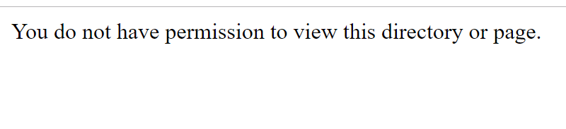

# Deploy ASP.NET Core Web Application (MVC) to Azure App Services


## runnig locally

```
dotnet restore
dotnet run
```

## deploying to Azure App Service


**using git**

```
git remote add azure <webapp git rul>
git push azure master
```
(works)


**using zip deploy**

```
dotnet build /nologo /p:PublishProfile=Release /p:PackageLocation="c:\Repos\world\world" /p:OutDir="c:\Repos\world\world" /p:DeployOnBuild=true /p:WebPublishMethod=Package /p:PackageAsSingleFile=true /maxcpucount:1 /p:platform="Any CPU" /p:configuration="Release" 
az webapp deployment source config-zip --resource-group <resource-group> --name <app-name> --src world.zip
```
(does not work)




## sources

**zip-deploy:**
* https://github.com/Azure/app-service-announcements/issues/84
* https://docs.microsoft.com/en-us/azure/azure-functions/run-functions-from-deployment-package
* https://stackoverflow.com/questions/42549140/how-to-build-and-release-app-to-azure-app-services-using-vsts
* https://github.com/projectkudu/kudu/wiki/Deploying-from-a-zip-file-or-url